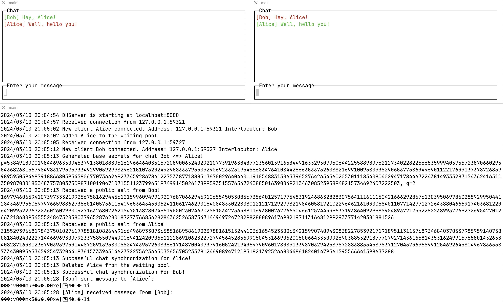
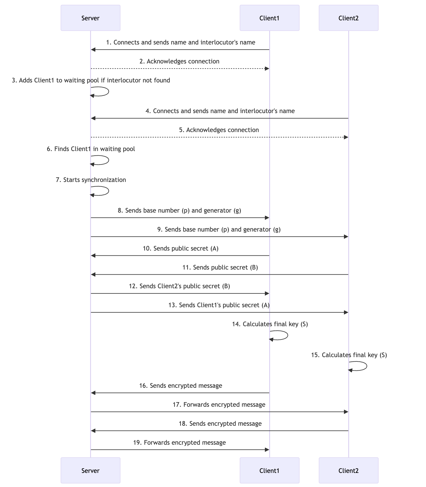

# Diffie-Hellman chat

A pet project, just to learn how the famous Diffie-Hellman algorithm works. It targets to provide two executables: __server__ and __client__. The server can be considered as a "public space", responsible for connecting pairs of clients and transferring their encrypted messages. The client can be considered as a classical "actor" in the algorithm data exchange process.

The project is built on Go 1.22.



## Server

The server acts as a transmitter of messages between multiple clients. It uses the `net.Listener` interface to receive incoming connections. As soon as a new `net.Conn` connection appears, it runs a separate goroutine to handle the client.

### Connection Handling

The `HandleConnection` method is where the main logic of the server resides. It:

1. Reads the client's name and interlocutor from the initial message.
2. Checks if the client is already in the waiting pool. If so, it sends a message back to the client and returns.
3. Creates a new DHClient instance and checks if the interlocutor is in the waiting pool.
4. If the interlocutor is not found, it adds the client to the waiting pool and handles the client as the first client.
5. If the interlocutor is found, it starts an immediate synchronization and handles the client as the second client.
6. Starts reading from the connection in a separate goroutine.
7. Enters a loop where it waits for messages from the interlocutor or the client, or for an error. Messages from the interlocutor are sent to the client, and messages from the client are sent to the interlocutor's write channel.

Essentially, communication between interlocutors is possible through string channels, which are initialized for the first client and reused for the second one.
After the synchronization, each client is represented with two goroutines:

* the main one, where the interlocutor's messages are handled
* the sidecar, where the client's messages are handled

### Encryption involvement

The server is responsible for the generation of the base number (`p`) and generator (`g`). 
The base number needs to be prime and big enough. In the current implementation, it will be 600+ digits `big.Int`.
To make sure that the generator is a prime root modulo of the base number, the `p` is calculated as a multiplication of some big prime number `q`, added to 1.


Thus, the generator can be safely assigned to 2, which serves the purpose just fine.

Then, it makes sure that both clients have provided their public secrets, and that they both have received their interlocutor ones. Due to the nature of the Diffie-Hellman algorithm, all further messages will be encrypted with the key, that the server doesn't know and won't be able to decrypt them.


## Client

The client acts as an actor, which first communicates with the server to reach out to the desired interlocutor. 
If the latter one is available, the immediate `Handshake` phase begins.
Otherwise, the client will be waiting for the interlocutor to appear.

### Interaction Handling

The `Interact` method is where the main logic of the client resides. It:

1. Reads the client's name and interlocutor's name from the user input.
2. Sends the client's name and interlocutor's name to the server.
3. Reads the server's response and handles it based on its prefix:
    * If the response indicates that the client already exists, it logs an error and exits.
    * If the response indicates that the interlocutor is found, it performs a handshake with the interlocutor and sets the encryption key.
    * If the response indicates that the interlocutor is not found, it waits for an update from the server. If the update indicates that the interlocutor is found, it performs a handshake with the interlocutor and sets the encryption key. If the update indicates that the interlocutor wait timeout has been reached, it logs a message and returns.
4. Initializes the GUI and sets the keybindings.
5. Starts a goroutine to handle server responses.
6. Enters the main loop of the GUI. If an error occurs in the main loop and it's not a quit error, it logs the error.

### Key preparation

Within the `Handshake` function, the client receives base secrets (`g` and `p`), generated for the chat by the server. Then, it generates a random private secret (`a`) in the range of `[1, p)` and calculates a public secret to share (`A`).


After the client receives a similarly generated interlocutor's public secret (`B`), the final key (`S`) can be finally generated.


### Encryption / decryption

Both the client and its interlocutor will have the same symmetric key, which will be used for any message. All messages will be encrypted / decrypted by the [`Advanced Encryption Standard`](https://en.wikipedia.org/wiki/Advanced_Encryption_Standard) alongside with [`Galois Counter Mode`](https://en.wikipedia.org/wiki/Galois/Counter_Mode) nonce.


## Sequence diagram of usage



## Installation

### Dependencies

* [gocui](https://pkg.go.dev/github.com/jroimartin/gocui)
* [crypto](https://pkg.go.dev/golang.org/x/crypto)

Initially, all external dependencies should be installed.

``` sh
go mod tidy
```

Afterward, both client and server programs can be run with a single command.

### Server

Only one instance can be run using the same address and port.

```sh
go run cmd/server/main.go
```

### Client

Multiple instances can connect to the same server simultaneously.

```sh
go run cmd/client/main.go
```